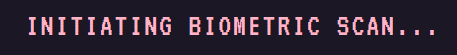
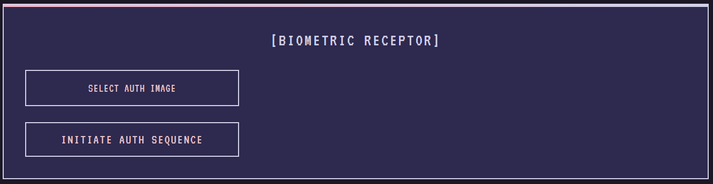
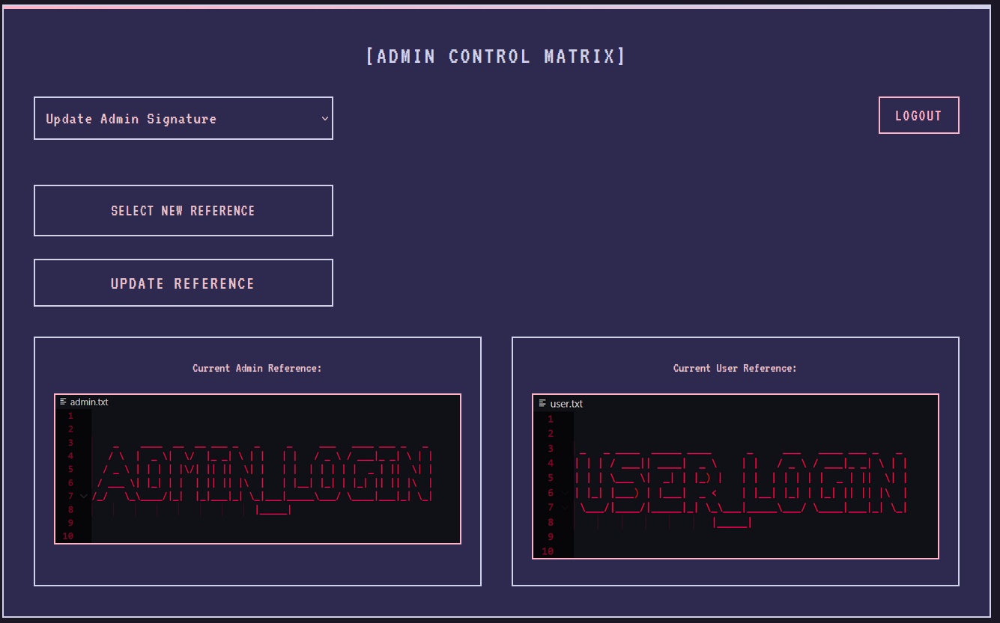

 

**ImageTextAuthenticator** is a **secure, image-based authentication system**. 
It verifies users by comparing uploaded images with stored references. Supports roles like `admin` and `user` for tailored access control.  

  
Users authenticate by uploading an image. 
The system calculates similarity with stored reference images, granting access based on a pre-defined threshold.  

  
**Admin users** can dynamically update reference images for both roles. 
This allows adaptability and better control over the authentication process.  

  
Clear feedback on authentication status, showing access level (`admin` or `user`) and similarity percentage, 
ensures transparency and confidence in the system.  

### Live URL:
[https://239f-34-106-146-39.ngrok-free.app/](https://239f-34-106-146-39.ngrok-free.app/)
